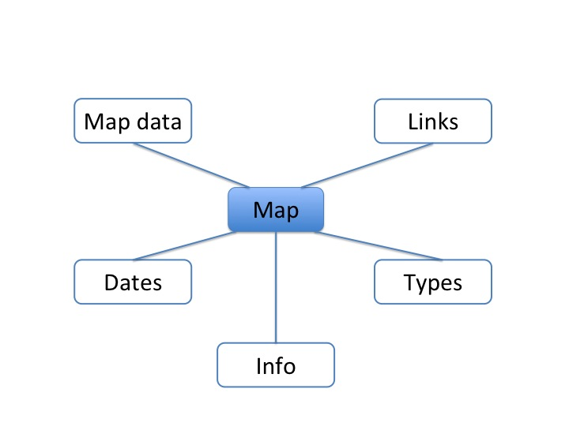

Map
===

.. |br| raw:: html

      

Im Zuge der Inventarisierung werden alle vorhandenen Karten, die sich im Kartenschrank in der
Postgasse 7, 1010 Wien befinden, in der DIAUMA-Datenbank online erfasst. Hierzu ist zumindest der
Name der Karte einzugeben. Allerdings kann dieser durch zahlreiche andere Metadaten angereichert
werden. Diese sind unten erklärt.

**To do**: auf die drei verschiedenen Kartentypen eingehen |br|
**To do**: Kommentar zur Schwierigkeit der Benennung der Karten |br|

.. contents:: :local:

Name *
------
The name is used for display in tables and can be searched.

Map id
------
This field can be used for an unique identifier.

Title
-----
This field can be used for the whole title e.g. in case there was chosen a shorter for display.

Scale
-----
If known the scale of the map can be entered here.

Width and height
----------------
These values are for the physical dimensions of a map. The default is in centimeter.

Date created
------------
The date when the map was created. Either only the first value is used or you can enter a time span
using the second field, too.

Date content
------------
The date of the map content. Either only the first value is used or you can enter a time span
using the second field, too.

Info
----
Additional information can be entered here.

Has base map
------------
You can chose one existing map which this map is based on.

Is copy of
----------
If this map is a copy you can chose one existing map as the original.

Created by
----------
Multiple persons can entered as creator of the map.

Issued at, Has current location
-------------------------------
You can select a place where the map was issued and where the map is currently located.

Published by
------------
Multiple institutes which participated in publishing the map can be selected.

Referenced by
-------------
Multiple references which the map is part of can be selected.
