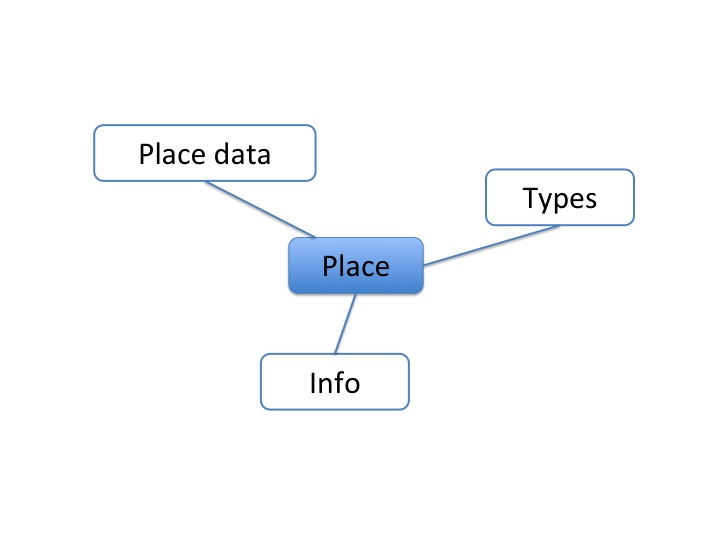

Place
=====

**To do**: kurzer Kommentar dazu

Places can be the location of institutes, persons and maps.

.. contents:: :local:

Name *
------
The name is used for display in tables and can be searched.

Info
----
Additional information can be entered here.
